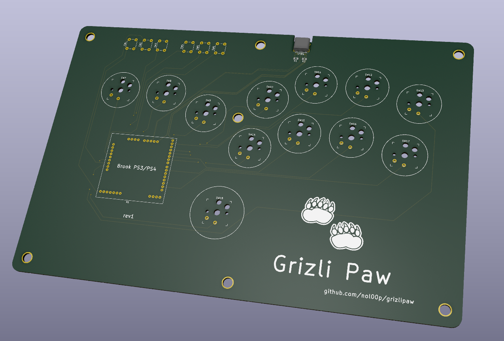

# The Grizli Paw Project

the final result so far:

# Acknoledgement
**All the initial work is from jfedor** at https://github.com/jfedor2/flatbox. Without his work this project would not have been possible. 

if you have questions on the build or any of the tools I used hit me up reddit [u/loss_of_signal](https://www.reddit.com/user/loss_of_signal)

# Though Process
I love to tinker and occasianly, play some games. I recently got back into some fighting game and wanted to try the famous hitbox. Today building is quite complicated has the stocks are super low everywhere - and tbh, building one is much more fun.

